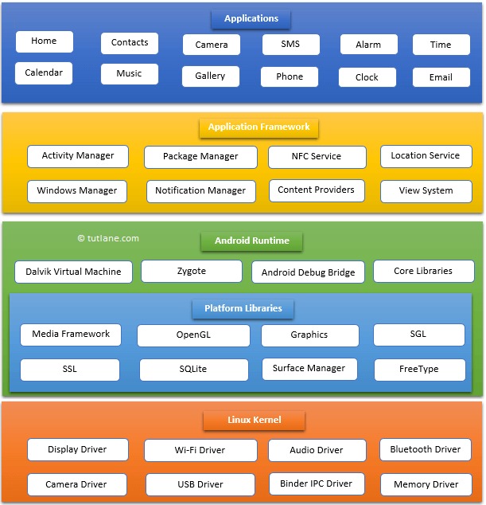

# Android Internals

Android is a linux based operating system, with more than 3 billion devices across the globe using this mobile operating system , android is the most used mobile operating system. it's an open-source operating system that means anyone can use it for free and also build their own version of it (check source code at <https://cs.android.com/android/platform/superproject/> )
Android development supports the full java programming language. Google states that[3] "Android apps can be written using Kotlin, Java, and C++ languages" using the Android software development kit (SDK), while using other languages is also possible.

Following are main components of android architecture those are

Applications
Android Framework
Android Runtime
Platform Libraries
Linux Kernel

Applications:

native and 3rd party applications reside on this layer . any application you install , build or download stays here

# TODO

### Intent
### Activity
### AndroidManifest
### Layout
