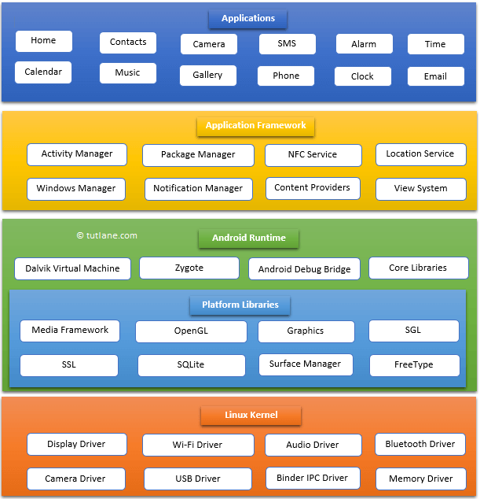

# Android Internals

## What You Will Learn
- How Android's architecture is layered
- What Dalvik and ART are and how Android runs Java code
- What Activities, Intents, and the AndroidManifest are
- How Android layouts and views work
- Why understanding Android internals is essential for mobile security

## What Is It?

Android is a Linux-based operating system, with more than 3 billion devices across the globe using it — making it the most used mobile operating system. It is an open-source operating system, meaning anyone can use it for free and build their own version of it. (Check the source code at <https://cs.android.com/android/platform/superproject/>)

Android development supports the full Java programming language. Google states that "Android apps can be written using Kotlin, Java, and C++ languages" using the Android software development kit (SDK), while using other languages is also possible.



## Android Architecture

The main components of Android's architecture (bottom to top):

1. **Linux Kernel** — The foundation. Provides hardware abstraction, process management, networking, and security. Android apps ultimately run on top of this.
2. **Platform Libraries** — Native C/C++ libraries such as libc, OpenGL ES, SQLite, WebKit, and OpenSSL.
3. **Android Runtime (ART)** — The environment that executes Android app code. Replaced the original Dalvik VM.
4. **Android Framework** — Java APIs that apps use: Activity Manager, Window Manager, Content Providers, View System, Notification Manager.
5. **Applications** — Native and third-party applications. Any app you install, build, or download stays here.

## Key Concepts

### Intent

An `Intent` is a messaging object used to request an action from another app component. It represents a way for one Activity to communicate with another and can carry data between components.

```java
Intent intent = new Intent(this, SecondActivity.class);
intent.putExtra("key", "value");
startActivity(intent);
```

### Activity

An `Activity` is a single screen with a user interface. Each Activity represents one screen in your app. Activities have a lifecycle: `onCreate()`, `onStart()`, `onResume()`, `onPause()`, `onStop()`, `onDestroy()`.

```java
public class MainActivity extends AppCompatActivity {
    @Override
    protected void onCreate(Bundle savedInstanceState) {
        super.onCreate(savedInstanceState);
        setContentView(R.layout.activity_main);
    }
}
```

### AndroidManifest.xml

The `AndroidManifest.xml` is the configuration file that Android uses to understand the app. It declares:

- The app's package name
- All Activities, Services, BroadcastReceivers, and ContentProviders
- Required permissions
- The launcher Activity (entry point)

```xml
<activity android:name=".MainActivity">
    <intent-filter>
        <action android:name="android.intent.action.MAIN" />
        <category android:name="android.intent.category.LAUNCHER" />
    </intent-filter>
</activity>
```

### Layout

A Layout defines how a View (a visual element) should look. Layouts are defined in XML files stored in `res/layout/`.

```xml
<LinearLayout xmlns:android="http://schemas.android.com/apk/res/android"
    android:orientation="vertical"
    android:layout_width="match_parent"
    android:layout_height="match_parent">

    <TextView
        android:text="Hello World"
        android:layout_width="wrap_content"
        android:layout_height="wrap_content" />
</LinearLayout>
```

### Dalvik and ART

Android apps are written in Java (or Kotlin), compiled to **Dalvik bytecode** by the Android toolchain, and stored in `.dex` (Dalvik Executable) files inside an APK.

- **Dalvik**: The original Android Virtual Machine. Used a JIT (Just-In-Time) compiler — it compiled bytecode to native code at runtime as needed. Used in Android versions before 5.0.
- **ART (Android Runtime)**: Replaced Dalvik in Android 5.0. Uses AOT (Ahead-Of-Time) compilation — it compiles the entire app to native code during installation, resulting in faster execution.

### Smali

**Smali** is the human-readable representation of Dalvik bytecode. It is like assembly language for the Dalvik VM. Security researchers decompile APKs to Smali to analyze the bytecode of an app.

```smali
.method public onCreate(Landroid/os/Bundle;)V
    .registers 2
    invoke-super {p0, p1}, Landroid/app/Activity;->onCreate(Landroid/os/Bundle;)V
    return-void
.end method
```

### Entry Point of an Android App (Launcher Activity)

The launcher activity is the first activity launched when an Android app starts. To find it, check `AndroidManifest.xml` — the launcher activity has both `android.intent.action.MAIN` and `android.intent.category.LAUNCHER` in its intent filter.

## Resources

- [Android Source Code](https://cs.android.com/android/platform/superproject/)
- [Android Developer Docs — App Fundamentals](https://developer.android.com/guide/components/fundamentals)
- [Android Security Guide](https://developer.android.com/topic/security/best-practices)
- [jadx — Android Decompiler](https://github.com/skylot/jadx)
