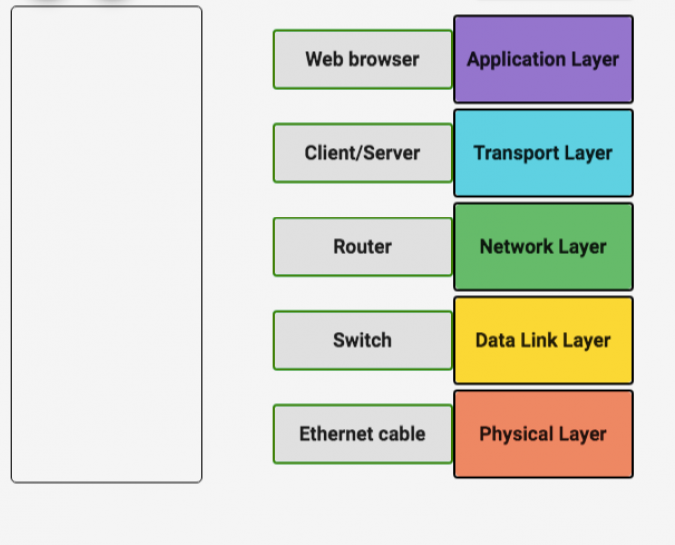

# Networking Explained

*Five-layer Model*

**Physical Layer** : This provide the means of transferring streams of data over a physical medium . The physical layer transfers data by converting it into electric signals and sends in through a wired or wireless medium (networking cable,  network adapters, ethernet, repeaters, networking hubs)

**Data Link Layer** : Responsible for interpreting the data transmitted in the physical layer , it allows protocols that makes sense of the streams of signals transferred in the physical layer 

**Network Layer** : Allows Diffrent network to connect with each other, responsible for getting data across a collection of networks, from one node to another.It selects and manages the best logical path for data transfer between nodes (IP)

**Transport Layer** : Sorts out who is suppose to get that data, make sure it gets to them . (TCP, UDP)

**Application Layer** : This "makes sense" of the data transmitted  (Browser)

Protocol :

To Understand this better, i will use a scenario of transferring a picture from your mobile phone to your laptop through Xender . 

Now, using the 5 layers model, lets see how this picture is being RECEIVED.

First, 

The Physical Layer :  Data at this layer is passed in form of electrical signal , the data sent in this form has been converted from binary (1s and 0s) to its equivalent voltage signal (usually 5v and 0v). at the receiving end the data is received and converted from these signals back into bits. using a general protocol both nodes understand, the receiver is able to make sense of (how quickly these data is sent , resolve collision domain ..etc.). 

Xender is an **application** that uses WIFI as a medium of communication (commmunication in this context means transferring and receiving data). The picture to be transferred through xender would have been converted to bits (1s and 0s , that's what the computer understands anyway) , visualize it this way, a picture of a cat will first represented as 100000111100000 , this is the only way a computer can send the picture to another computer. The phone to receive this picture has to get this stream of data 100000111100000 exactly and convert it into a picture. Note if just one of this bit is lost during transmission , it can corrupt the data , the picture will be unviewable .
Wifi in this case , is the physical layer in this model. how fast these is sent , frequency to use is determined by this physical layer protocol. In this layer we assume the 1s and 0s has been transferred and received from the phone to the laptop

Now , Lets look 
Data Link Layer : This layer checks if there is an error during transfer of the picture , remember if just a 0 is missing it may render the whose picture unreadable 

Transport `x 
port : 16-bit number used to direct traffic to specific servuces on a network computer
