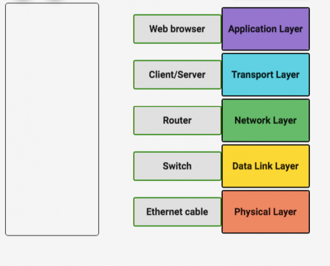

# Networking Explained

## What You Will Learn
- How the five-layer networking model works
- What each layer does and what protocols live there
- How data travels from one device to another over a network
- What IP addresses, MAC addresses, ports, and protocols are

## What Is It?

Networking is the foundation of everything in cybersecurity. Every attack and every defense relies on understanding how data moves between devices. The **five-layer model** (also called the TCP/IP model) gives us a framework to understand this.

## The Five-Layer Model

| Layer | Name | Responsibility | Examples |
|-------|------|----------------|---------|
| 5 | Application | Makes sense of the data | Browser, Xender, HTTP, DNS |
| 4 | Transport | Gets data to the right service on the right machine | TCP, UDP |
| 3 | Network | Routes data across different networks | IP, ARP |
| 2 | Data Link | Transfers data between nodes on the same network | Ethernet, MAC address |
| 1 | Physical | Transmits raw bits over a physical medium | Cables, Wi-Fi, Hubs |

**Physical Layer**: Provides the means of transferring streams of data over a physical medium. The physical layer transfers data by converting it into electric signals and sends them through a wired or wireless medium (networking cable, network adapters, Ethernet, repeaters, hubs).

**Data Link Layer**: Responsible for interpreting the data transmitted in the physical layer. It allows protocols that make sense of the streams of signals transferred at the physical layer.

**Network Layer**: Allows different networks to connect with each other. Responsible for getting data across a collection of networks from one node to another. It selects and manages the best logical path for data transfer between nodes. This is where IP operates.

**Transport Layer**: Sorts out who is supposed to get that data and makes sure it gets there. This is where TCP and UDP operate.

**Application Layer**: "Makes sense" of the data transmitted. The primary user interface with the communication system (browser, Xender).

---

**Port**: A 16-bit number used to direct traffic to specific services on a networked computer.

---

## How It All Works Together — Sending a Picture with Xender

To understand this better, let's look at a scenario of transferring a picture from your mobile phone to your laptop through Xender.

Using the five-layer model, here is how this picture is **received**:

**Application Layer:**

Sending a picture takes many steps — we're lucky we don't have to go through them manually every time. Before communication even starts, both devices must be on the same network. In our case, the laptop and the phone are connected through Wi-Fi. At this layer, we specify what data we want to send (the picture) and which device we want to send it to.

**Transport Layer:**

Here the port we want to transfer through is determined and the mode we want to use (TCP or UDP). Your mobile phone does multiple operations at a time — you may be visiting the web, streaming some music, etc. These different services use different ports. The port opened for this communication is where the data will be sent through.

**Network Layer:**

Attached to the laptop's MAC address is an IP address, which is handled in this layer. It allows cross-network communication between nodes — even if they are not on the same network. It accepts and delivers packets for the network by mapping the IP address to the MAC address using ARP.

**Data Link Layer:**

The primary purpose of this layer is to abstract away the need for other layers to care about the physical layer and the hardware in use. This layer checks for errors during transfer — if just one bit is missing, it may render the picture unreadable. It also determines which node the connection is meant for, using the MAC address, since both the phone and the laptop are on the same local network.

**Physical Layer:**

Data at this layer is passed as electrical signals. The data has been converted from binary (1s and 0s) to equivalent voltage signals (usually 5V and 0V). At the receiving end, the data is received and converted from these signals back into bits. The picture of a cat would be represented as something like `100000111100000` — the only way a computer can send it to another computer. If just one bit is lost during transmission, the picture could be corrupted.

Wi-Fi is the physical layer in this model — it determines how fast data is sent and what frequency to use.

## Resources

- IP command reference: https://www.linode.com/docs/guides/how-to-use-the-linux-ip-command/
- Scapy cheat sheet: https://wiki.sans.blue/Tools/pdfs/ScapyCheatSheet_v0.2.pdf
- [TryHackMe — Pre-Security Networking](https://tryhackme.com/path/outline/presecurity)
