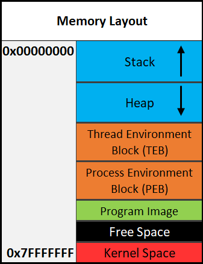

# Learning Assembly Lannguage (INTEL SYNTAX)


## X86 

This is a 32 bit register architechture. 

### Registers
- For Floating point values
    - XMM0 to XMM15 
- General Purpose: EAX, EBX, ECX, EDX,  ESI, EDI, EBP and ESP 
    - EAX : Accumulator registers (for arithmetic)
    - EBX : Base registers (for base pointer, sometimes return value and arguments to syscall)
    - ECX : Counter Register
    - EDX : Data registers


### BITS AND BYTES

Bit is one binary.
Nibble is 4 bits, one digit of a hex.
Byte is 8 bits, two digit hex.
Word is 2 bytes.
Double Word (DWORD) is 4 bytes. Twice the size of a word.
Quad Word (QWORD) is 8 bytes. Four times the size of a word. 


### Common Terms to know before proceeding (with Simple Assembly example)

- An immediate value (or just immediate, sometimes IM) is something like the number 12. An immediate value is not a memory address or register, instead, it's some sort of constant data.

- A register is referring to something like RAX, RBX, R12, AL, etc.

- Memory or a memory address refers to a location in memory (a memory address) such as 0x7FFF842B.


### Operand


#### Mul
takes only one one operand and multiplies it with the value stored in EAX and stores the result in EDX:EAX.

```x86asm
mov EAX, 25
mov EBX, 5
mul EBX ; Multiplies EAX (25) with EBX (5)
```

### Div

takes only one one operand and dividesEAX with the value stored in the operanf and stores the result in EDX:EAX.

```x86asm
mov EAX, 18
mov EBX, 3
div EBX ; Divides EAX (18) by EBX (3)
```

### CMP

CMP compares two operands and sets the appropriate flags depending on the result.

```x86asm
mov RAX, 8
cmp RAX, 5
```

### Dereferencing

```
mov rax, [rdi]         <=>     Moves the thing stored at the address of what rdi holds to rax
```

```
mov [rax], rdi         <=>     Moves rdi to the address of what rax holds.
```

### NOP

Nop is short for No Operation. This instruction effectively does nothing. its usually used for padding.


### Rept

```
.rept <num of times>
    nop
.endr
```

### Example

```x86asm
mov RAX, x          ; move variable from memory into register
cmp RAX, 4          ; compare immediate value with register value, set flag based on comparation
jne 0x7FFF842B      ; (ret) jump to a memory address 
call func1
ret
```


### STACK




### Arrays
Arrays store multiple pieces of data which are the same type sequentially in memory. Let's say you have an array of 5 integers that starts at the address of 0x4000. 
The size of the array is 20 bytes since each integer is 4 bytes. The first integer is at 0x4000+0x0, the second is at 0x4000+0x04, and so on.

Let's say we have an array of 4 integers that starts at the address of 0x4000. 

```c
int numbers[4] = {0, 1, 2, 3};
```

In memory
```x86asm
0x4000: 0 ; 4 bytes long
0x4004: 1 
0x4008: 2
0x4012: 3
```

### Classes


```x86asm
mov RAX, 0x4000     ; RAX = Address of the class and the age variable (offset 0)
lea RBX, [RAX+0x4]  ; RBX = Address of height
lea RCX, [RAX+0x8]  ; RCX = Address of name
mov [RAX], 0x32     ; age = 50
mov [RBX], 0x48     ; height = 72
mov [RCX], 0x424F42 ; name = "BOB"
```

## X86_64

Floating point : YMM0 to YMM15,  256-bit wide each and can hold 4 64-bit values or 8 32-bit values


## ARM

Refer to :
[Arm](https://proflamyt.github.io/300days-of-hacking/Topic79)


 https://github.com/proflamyt/300days-of-hacking/tree/main/Topic79

solving mx + b

### Multiplication
```asm
imul rdi, rsi;
add rdi, rdx;
mov rax, rdi;
```

### Division 
To Divide, one must first place the value to be devided into register 'rax' , then run the next instruction which is  div [value to devide by]. after division, The quotient is placed in rax, the remainder is placed in rdx.

solving 'rax = rdi / rsi; rdx = remainder'

```asm
mov rax, rdi;
div rsi;
```
### modulus
solving rdi % rsi

```asm
mov rax, rdi;
div rsi;
xor rax, rax;
mov rax, rdx;
```

### Part of a register

```plaintext
=================================================
%rax         %eax         %ax         %al
%rcx         %ecx         %cx         %cl
%rdx         %edx         %dx         %dl
%rbx         %ebx         %bx         %bl
%rsi         %esi         %si         %sil
%rdi         %edi         %di         %dil
%rsp         %esp         %sp         %spl
%rbp         %ebp         %bp         %bpl
%r8          %r8d         %r8w        %r8b
%r9          %r9d         %r9w        %r9b
%r10         %r10d        %r10w       %r10b
%r11         %r11d        %r11w       %r11b
%r12         %r12d        %r12w       %r12b
%r13         %r13d        %r13w       %r13b
%r14         %r14d        %r14w       %r14b
%r15         %r15d        %r15w       %r15b
```


```plaintext
+----------------------------------------+
|                   rax                  |
+--------------------+-------------------+
                     |        eax        |
                     +---------+---------+
                               |   ax    |
                               +----+----+
                               | ah | al |
                               +----+----+
```


```asm
mov al, dil; // last 8 bit of rdi
mov bx, si; // last 16 bits of rsi
```
### Loop

calculate average 
rdi = memory address of the 1st quad word
rsi = n (amount to loop for)
rax = average computed

```asm
mov rcx, 0;

loop:
    cmp rsi, rcx;
    je _end;
    add rax, [rdi + rcx * 8]
    inc rcx
    jmp loop;
_end:
    div rsi;
```
### function call
c equivalence

```c
str_lower(src_addr):
    i = 0
    if src_addr != 0:
        while [src_addr] != 0x00:
            if [src_addr] <= 0x5a:
                [src_addr] = foo([src_addr])
                i += 1
            src_addr += 1
    return i
```

```asm
str_lower:
    mov rcx, 0;
    cmp rdi, 0x0;
    je .exit;
    loop:
        cmp byte ptr [rdi], 0x0;
        je .exit;
        cmp byte ptr [rdi], 0x5a
        jg .inc_src
        mov r9, 0x403000;
        mov r10, rdi;
        xor rdi, rdi;
        mov dil, [r10]
        call r9;
        mov rdi, r10
        mov [rdi], al
        inc rcx
        jmp .inc_src


.inc_src:
    inc rdi;
    jmp loop

.exit:
    xor rax, rax;
    mov rax, rcx
    ret
```

```asm
Let's use the following instructions as an example:
0x1021 mov rax, 0x400000
0x1028 call rax
0x102a mov [rsi], rax

1. call pushes 0x102a, the address of the next instruction, onto the stack.
2. call jumps to 0x400000, the value stored in rax.
The "ret" instruction is the opposite of "call". ret pops the top value off of
the stack and jumps to it.
```


### STACK

setting up stack 

```asm
mov rbp, rsp
; allocate space
sub rsp, 0x14
; perform ops
mov eax, 1337
mov [rbp-0x8], eax
; restore the allocated space
mov rsp, rbp
ret

```


### FUNCTION CALLS LINUX

#### Registers for Function Arguments 

RDI: First argument

RSI: Second argument

RDX: Third argument

RCX: Fourth argument

R8: Fifth argument

R9: Sixth argument

** Stack Usage **
If there are more than six arguments, or if any arguments are larger than 8 bytes (like structures), the additional arguments are passed on the stack. In such cases, the caller must ensure that the stack is properly aligned (to a 16-byte boundary) before the call.


### FUNCTION CALLS WINDOWS
```
func1(int a, int b, int c, int d, int e, int f);
// a in RCX, b in RDX, c in R8, d in R9, f then e pushed on stack
```

WriteFile windows asm
```
BOOL WriteFile(
  [in]                HANDLE       hFile,
  [in]                LPCVOID      lpBuffer,
  [in]                DWORD        nNumberOfBytesToWrite,
  [out, optional]     LPDWORD      lpNumberOfBytesWritten,
  [in, out, optional] LPOVERLAPPED lpOverlapped
);
```

```
mov rcx, 0xb4
mov rd, buf
mov r8, 100
mov r9, 0
mov r8, 100
mov r9, 0
sub rsp, 0x28
mov r11, 0
mov [rsp + 32], r11
```

windows shadow space -> 32 bytes 
space for the callee to optionally save the first 4 registers if needed 

Add 8 bytes to account for misalignment of the stack after push rbp

```
rsp + 0 -> rcx
rsp + 8 -> rdx
rsp + 0x10 -> r8
rsp + 0x18 -> r9
rsp + 0x20 -> 5th arg
```


reference: 
https://tryhackme.com/room/win64assembly
https://learn.microsoft.com/en-us/cpp/build/x64-calling-convention?view=msvc-170
