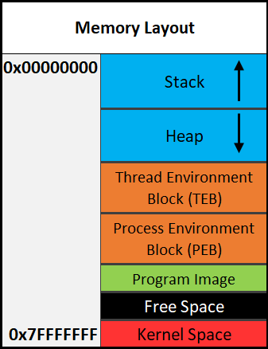

# Learning Assembly Language (Intel Syntax)

## What You Will Learn
- The difference between x86 (32-bit) and x86-64 (64-bit) registers
- How arithmetic, comparison, and memory instructions work
- How the stack is used for function calls
- How Linux and Windows differ in function calling conventions
- How to write and trace assembly code

## X86

This is a 32-bit register architecture.

### Registers

- **Floating point values**: XMM0 to XMM15
- **General Purpose**: EAX, EBX, ECX, EDX, ESI, EDI, EBP, and ESP
  - `EAX`: Accumulator register (for arithmetic)
  - `EBX`: Base register (sometimes return value and arguments to syscalls)
  - `ECX`: Counter register
  - `EDX`: Data register


### Bits and Bytes

| Unit | Size |
|------|------|
| Bit | 1 binary digit |
| Nibble | 4 bits (one hex digit) |
| Byte | 8 bits (two hex digits) |
| Word | 2 bytes |
| Double Word (DWORD) | 4 bytes |
| Quad Word (QWORD) | 8 bytes |


### Common Terms

- An **immediate value** (IM) is a constant like the number 12 — not a memory address or register.
- A **register** refers to something like RAX, RBX, R12, AL, etc.
- A **memory address** is a location in memory such as `0x7FFF842B`.


### Operands

#### MUL

Takes one operand and multiplies it with the value in EAX. Stores the result in EDX:EAX.

```x86asm
mov EAX, 25
mov EBX, 5
mul EBX ; Multiplies EAX (25) with EBX (5)
```

### DIV

Takes one operand and divides EAX by it. Stores the quotient in EAX and the remainder in EDX.

```x86asm
mov EAX, 18
mov EBX, 3
div EBX ; Divides EAX (18) by EBX (3)
```

### CMP

Compares two operands and sets the appropriate flags depending on the result.

```x86asm
mov RAX, 8
cmp RAX, 5
```

### Dereferencing

```x86asm
mov rax, [rdi]    ; Move the value AT the address in rdi into rax
mov [rax], rdi    ; Move rdi into the memory address stored in rax
```

### NOP

NOP stands for No Operation. This instruction does nothing. It is usually used for padding or as a placeholder.

### REPT

```x86asm
.rept 10
    nop
.endr
```

### Example

```x86asm
mov RAX, x          ; move variable from memory into register
cmp RAX, 4          ; compare immediate value with register, set flags
jne 0x7FFF842B      ; jump to address if not equal
call func1
ret
```


### Stack

The stack grows downward in memory. `PUSH` decrements `RSP` (the stack pointer) and writes to it. `POP` reads from `RSP` and increments it.




### Arrays

Arrays store multiple pieces of the same data type sequentially in memory. If an array of 5 integers starts at address `0x4000`, each integer is 4 bytes:

```c
int numbers[4] = {0, 1, 2, 3};
```

In memory:

```x86asm
0x4000: 0   ; 4 bytes
0x4004: 1
0x4008: 2
0x400C: 3
```

### Classes

```x86asm
mov RAX, 0x4000     ; RAX = address of the object (age field, offset 0)
lea RBX, [RAX+0x4]  ; RBX = address of height
lea RCX, [RAX+0x8]  ; RCX = address of name
mov [RAX], 0x32     ; age = 50
mov [RBX], 0x48     ; height = 72
mov [RCX], 0x424F42 ; name = "BOB"
```

## X86-64

In 64-bit mode, the general-purpose registers are 64 bits wide: RAX, RBX, RCX, RDX, RSI, RDI, RBP, RSP, and R8–R15.

Floating point: YMM0 to YMM15 (256-bit wide, can hold 4 × 64-bit or 8 × 32-bit values).

### Register Subdivisions

```plaintext
+----------------------------------------+
|                   rax                  |
+--------------------+-------------------+
                     |        eax        |
                     +---------+---------+
                               |   ax    |
                               +----+----+
                               | ah | al |
                               +----+----+
```

```plaintext
=================================================
%rax   %eax   %ax   %al
%rcx   %ecx   %cx   %cl
%rdx   %edx   %dx   %dl
%rbx   %ebx   %bx   %bl
%rsi   %esi   %si   %sil
%rdi   %edi   %di   %dil
%rsp   %esp   %sp   %spl
%rbp   %ebp   %bp   %bpl
%r8    %r8d   %r8w  %r8b
%r9    %r9d   %r9w  %r9b
...
%r15   %r15d  %r15w %r15b
```

### Function Calls — Linux Calling Convention

Arguments are passed in registers in this order:

| Register | Argument |
|----------|---------|
| RDI | First |
| RSI | Second |
| RDX | Third |
| RCX | Fourth |
| R8 | Fifth |
| R9 | Sixth |

If there are more than six arguments, the rest are pushed onto the stack. The caller must ensure the stack is 16-byte aligned before the call.

### Function Calls — Windows Calling Convention

```c
func1(int a, int b, int c, int d, int e, int f);
// a in RCX, b in RDX, c in R8, d in R9, e and f pushed on stack
```

Windows uses a **shadow space** of 32 bytes — space for the callee to optionally save the first 4 registers.

```x86asm
WriteFile windows asm signature:
BOOL WriteFile(
  HANDLE       hFile,
  LPCVOID      lpBuffer,
  DWORD        nNumberOfBytesToWrite,
  LPDWORD      lpNumberOfBytesWritten,
  LPOVERLAPPED lpOverlapped
);
```

### Loop Example (Calculate Average)

```asm
; rdi = memory address of first quad word
; rsi = n (number of elements)
; rax = computed average
mov rcx, 0

loop:
    cmp rsi, rcx
    je _end
    add rax, [rdi + rcx * 8]
    inc rcx
    jmp loop
_end:
    div rsi
```

### Function Call and Return

```
0x1021  mov rax, 0x400000
0x1028  call rax          ; pushes 0x102a onto the stack, jumps to 0x400000
0x102a  mov [rsi], rax

; "ret" pops the top value off the stack and jumps to it (returns to 0x102a)
```

### Setting Up the Stack Frame

```asm
mov rbp, rsp
sub rsp, 0x14       ; allocate local space
mov eax, 1337
mov [rbp-0x8], eax
mov rsp, rbp        ; restore stack
ret
```

## ARM

Refer to: [Arm64 Assembly (Topic79)](https://proflamyt.github.io/300days-of-hacking/Topic79)

Also: https://github.com/proflamyt/300days-of-hacking/tree/main/Topic79

### Example — Solving `mx + b`

```asm
imul rdi, rsi   ; rdi = rdi * rsi
add rdi, rdx    ; rdi = rdi + rdx
mov rax, rdi    ; return value in rax
```

### Division

```asm
; rax = rdi / rsi, rdx = remainder
mov rax, rdi
div rsi
```

### Modulus

```asm
; rdi % rsi
mov rax, rdi
div rsi
xor rax, rax
mov rax, rdx
```

## Resources

- [TryHackMe — Windows x64 Assembly](https://tryhackme.com/room/win64assembly)
- [Microsoft — x64 Calling Convention](https://learn.microsoft.com/en-us/cpp/build/x64-calling-convention?view=msvc-170)
- [GNU Assembler Manual](https://ftp.gnu.org/old-gnu/Manuals/gas-2.9.1/html_chapter/as_7.html)
- [CS:APP — Computer Systems: A Programmer's Perspective](http://csapp.cs.cmu.edu/)
